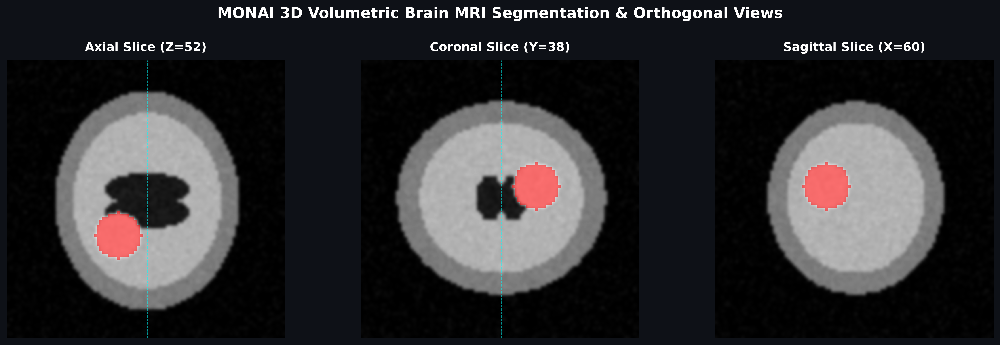

#  3D Volumetric Brain MRI Segmentation & Multi-Planar Reconstruction (MONAI)

An end-to-end 3D medical image analysis pipeline built with **MONAI (Medical Open Network for AI)** and **PyTorch**. The system processes volumetric NIfTI (`.nii.gz`) neuroimaging scans, executes research-grade spatial and intensity transforms, runs 3D UNet segmentation inference, and produces **3-axis Multi-Planar Orthogonal Reconstructions (MPR)**.

---

##  Multi-Planar Orthogonal Visualization (MPR)

Below is the synchronized 3-axis orthogonal cross-section (Axial, Coronal, Sagittal) showing the T1-weighted anatomical brain structures and the localized lesion segmentation overlay:



---

##  Core Capabilities

* **Volumetric Preprocessing:** Dictionary-based MONAI pipeline implementing affine reorientation (`RAS`), isotropic voxel resampling (`Spacingd`), and percentile intensity normalization.
* **3D Architecture:** Volumetric PyTorch `UNet` configured with 3D spatial convolutions and residual skip connections.
* **Medical Data Standards:** Native compatibility with compressed neuroimaging format (`.nii.gz`) using `nibabel` and `SimpleITK`.
* **Clinical Reconstruction:** Multi-planar orthogonal slice extraction with crosshair alignment and heatmap alpha-blending.

---

##  Tech Stack

* **Framework:** MONAI & PyTorch
* **Data Processing:** SimpleITK, Nibabel, NumPy, SciPy
* **Visualization:** Matplotlib Multi-Planar Slicing Engine

---

##  Quick Start

### 1. Clone the Repository
```bash
git clone [https://github.com/cyberpunk92/3d-brain-mri-monai.git](https://github.com/cyberpunk92/3d-brain-mri-monai.git)
cd 3d-brain-mri-monai
```

### 2. Install Dependencies
```bash
pip install -r requirements.txt
```

### 3. Run Pipeline & Export Visualizations
```bash
python main.py
```
